# MyLac 🤖  
*Where Machine-Learning textbooks come to life*


---

MyLac is a **RAG chatbot** tailored for Machine-Learning students and researchers.  
We fed it **a few PDF textbook**, let Mineru/PyMuPDF extract semantically-rich contents, chunk & embed via Ollama, and chat with evidence-backed answers **grounded exclusively in your knowledge base**.

---

## 📦 Features  
- **Dual-persona** — switches between “research verifier” and “teacher” based on your question tone.  
- **Automatic ingestion** — OCR, table, image and formula extraction via **Mineru** pipelines.  
- **State-of-the-art embeddings** — Ollama + `mxbai-embed-large`.  
- **Vector storage on Qdrant Cloud** — ready for large-scale collections.  
- **Polished Streamlit UI** — dark-theme ✨ & mobile-friendly.  


---

## 🚦 Quick Start

> Prerequisites: Python 3.13+, Ollama running locally .

####  Clone & setup
```bash
git clone https://github.com/MissLostCodes/MyLac.git
cd mylac
uv init  
uv add -r requirements.txt
```

Create an env file : 
```bash

OLLAMA_MODEL=llama3.2:3b  # any model pulled in Ollama
GOOGLE_MODEL=gemini-2.0-flash
GOOGLE_API_KEY=<your key>
QDRANT_URL=https://<cluster>.gcp-cloud.qdrant.io
QDRANT_API_KEY=<your-key>
COLLECTION_NAME=ml_textbooks
MINERU_TOKEN=<mineru-secret>          # optional PDF parse
```

(Optional) Pull your embeddings model in Ollama:

```bash
ollama pull mxbai-embed-large
```

####  GPU/Arrow support on Mac
```bash
brew install poppler tesseract   # OCR deps
```

---

## 📚 Ingest Your Textbooks

1. Drop `.pdf` books into `KnowledgeBase/` (folder is Git-ignored).  
2. Run ingestion pipeline:  
```bash
python -m modules.pipelines.process_mineru_pdfs 
python -m modules.pipelines.upload_to_qdrant

OR 
 
python -m modules.pipelines.load_and_chunk_pdf
python -m modules.pipelines.upload_to_qdrant
```

Pipelines create:
- `outputs/<book_slug>/chunks.jsonl`
- Assets (images/tables/formulas)
- Unity in Qdrant collection.

---

## 🖥️ Chat

Start the UI:

```bash
uv run streamlit run main.py
```

- Browse to http://localhost:8501  
- [▶️ Start Chat] to activate session.  
- Type **any ML question**—responses include **page & title citations**.

---

## 🏗️ Architecture Overview

```mermaid
graph TD
  KB[KnowledgeBase/*.pdf] --> Mineru[Mineru Parse API]
  Mineru --> Output[outputs/**/*.jsonl]
  Output --> Embedder[Ollama Embeddings]
  Embedder --> Qdrant[(Qdrant Vector Store)]
  Query[User ► Streamlit] --> LLM[LangChain Agent]
  LLM --> Qdrant
  Qdrant --> LLM
  LLM --> Answer[Evidence-based Answer]
```



---

## 🧰 Tech Stack

| Area               | Technology               |
|--------------------|--------------------------|
| LLM Providers       | Ollama, Google Gemini  (optional) |
| Embedding Engine    | `mxbai-embed-large` via Ollama |
| Vector DB           | Qdrant Cloud (gRPC disabled) |
| UI Framework        | Streamlit, custom CSS    |
| OCR / Table Tools   | PyMuPDF, pdfplumber, pytesseract , mineru |
| RAG Framework       | LangChain, LangGraph     |

---

## ➕ Contributing

We welcome **code**, **model suggestions** and **documentation** improvements!

1. Fork → `feature/${username}-${topic}`
2. Format & lint:
   ```bash
   pip install ruff isort
   ruff check . --fix
   isort .
   ```
3. Add unit tests (`pytest tests/`)
4. PR against `main` branch with clear summary & screen-recording 🎬

####  Dev loops
```bash
python -m pytest                              # quick unit tests
streamlit run modules/dev/debug_ui.py         # toast layouts
```

---

## 🐛 Troubleshooting

| Symptom                             | Fix                                                                                                                                  |
|-------------------------------------|--------------------------------------------------------------------------------------------------------------------------------------|
| `ImportError: libGL.so.1` on Linux  | `sudo apt install libgl1-mesa-glx libglib2.0-0 libsm6 libxext6 libxrender-dev libgomp1`                                                 |
| Qdrant connection timeout            | Ensure `https://` prefix & regional cluster endpoint, disable `prefer_grpc=True`.                                                      |
| OCR returns empty lines              | Quality diff. Zoomed equation images or low DPI can cause failure—normal, ignored later.                                               |

---
